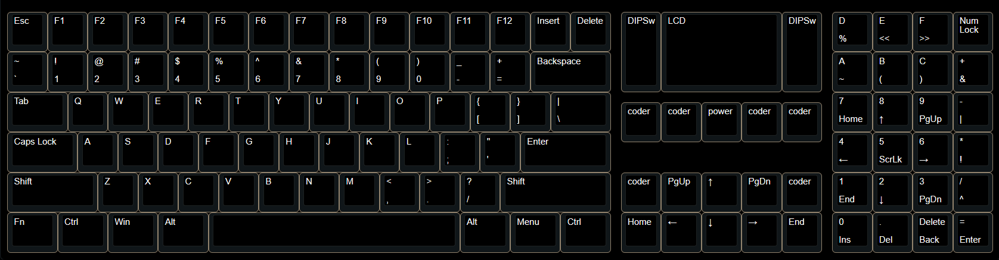
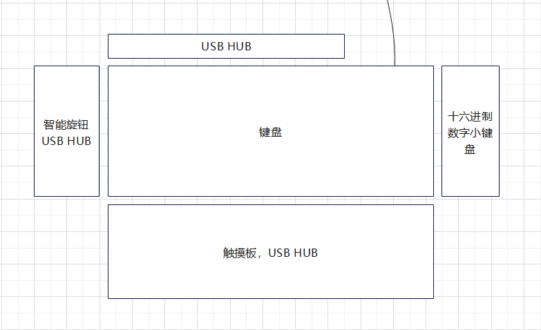
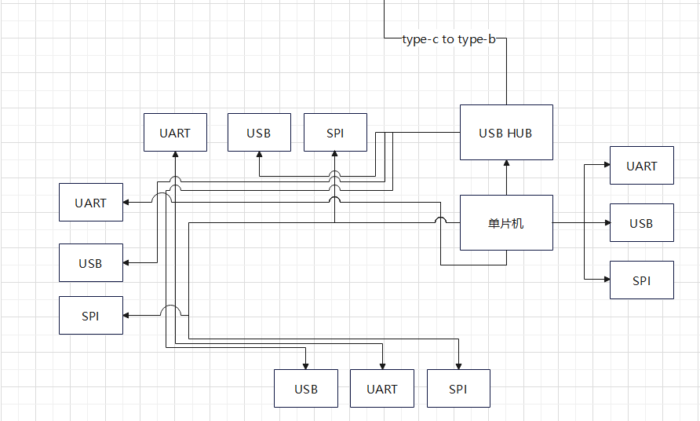
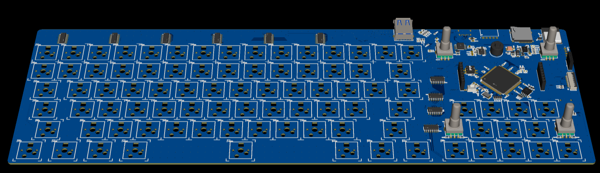

 # DIYkeyboard
**进度**
* 立项构想选型 2022-7-25
* 项目开发启动 2023-1-2
* 电路板绘制 2023-1-8
* LCD电路测试失败 2023-2-18
* 电路板绘制完成 2023-3-5
* 有序猜测所有电路 2023-3-6
* LCD电路测试(SMT)失败 2023-3-20
* 8bit并口ST7789 LCD显示屏成功显示(原因:8bit数据引脚顺序接反) 2023-3-21
* 推翻30%的电路设计, 进一步模块化电路 2023-4-6
* AT32 XMC驱动并口LCD成功 2023-4-7
* AT32F435 核心板验证成功 2023-5-18
* bootloader 开发完成 2023-5-23
* 底板设计完成 2023-5-28

## 设计初衷
* 在我喜欢使用键盘上下左右键移动光标来编辑代码, 但是目前HOME和END键离上下左右键太远, 所以我把HOME和END键放在了上下左右键的旁边, 并且把翻页键也移动了.
* 有因为光标远距离移动要经常按同一方向的键, 所以我添加了编码器来解决大量按同一方向键的问题.
* 然后我添加了屏幕, 是为为了设置显示状态, 快速设置键盘参数, 快速切换模式, 这个屏幕我会按智能手表的思路设计
* 拓展接口是为连接其他模块, 键盘分别有上下左右四个方向的接口, 因为我先要非常多的功能, 多到我自己也乱了, 所以我选择了模块化设计, 然后后期我再开放编程接口让可玩性更高, 但是有一个问题, 开放接口必定会影响硬件系统的稳定性, 后期慢慢优化吧
* 模块化硬件, 键盘采用两个M.2接口插座和核心板连接, 可以方便的升级替换核心板. 

在键盘能使用的情况下使用串口终端?
85 key rgb lde 2ms delay 10ms

键盘下侧添加接口外接?

可二次开发， 内部编程的键盘

键盘PCB基本完成, 目前考虑再加入一个usb2.0 hub芯片用来连接内部键盘输出和串口,
这样就是USB3.0 hub挂一个USB2.0hub连接到主控

## 键盘布局

## 键盘拓扑模块

## 键盘拓扑模块走线

## 第一版本大致外形

### 上侧模块

接口：
* USB 3.0 USB HUB
* GPIO
* SPI
* UART

硬件：
* USB 3.0接口
* 弹簧针触点

模块：
* GOIO开发拓扑
* USB HUB

### 左侧模块

接口：
* USB 3.0 USB HUB
* SPI
* UART

硬件：
* 弹簧针触点

模块：
* 智能旋钮
* USB HUB

### 下侧模块

接口：
* USB 3.0 USB HUB
* SPI
* UART

硬件：
* 弹簧针触点

模块：
* 触摸板
* USB HUB
* 外接电池

### 右侧模块

接口：
* USB 2.0 连接单片机
* SPI
* UART

硬件：
* 弹簧针触点

模块：
* 十六进制小键盘

## 硬件
* [x] AT32F435ZMT7 (单片机问题，外设功耗大)
    * RTC电路
    * 时钟电路
    * debug电路
    * 复位电路
    * BOOT电路
* [x] Flash EN25QH128A
* [x] SD卡
* [x] ~~拨码管 12pin*2 74HC165~~
* [x] ST7789 8080 设计底板 [LCD](https://item.taobao.com/item.htm?spm=a1z10.5-c-s.w4002-23991449502.11.6928400cWlnPG5&id=636496300109)
* [x] USB 3.0 HUB GL3520
* [x] 编码器
* [x] 磁连接触点 (SPI&uart, 四个方向, FFC 30cm 24P， 设计转接板)
* [x] 电池管理电路 [电池](https://item.taobao.com/item.htm?spm=a230r.1.14.48.32493d7ehBpi5Y&id=640378174518&ns=1&abbucket=18#detail)
* [x] RGB灯 WS2812
* [x] usb type-c (偏右侧靠近芯片)
* [x] 蓝牙模块 (暂时没有选型) 
    邪道用法， 由于从设备不能主动选择连接主设备，所以考虑使用两颗蓝牙芯片，让两颗芯片分别连接不同设备，当切换设备时， 设置一个芯片待机， 一个工作，加上有线模式，可快速切换三个设备控制。问题：两个芯片会不会有干扰，蓝牙依然无法使用拓展模块
* [x] 旋钮开关
* [x] 键盘 采用稚晖君的解决方案 使用标准元件库
* [ ] 定位板和外壳

## 驱动
* [x] lcd 8080
* [ ] 编码器
* [ ] ~拨码管，使用IO拓展芯片扫描~
* [ ] 按键
* [ ] USB HID
* [ ] 蓝牙
* [ ] SD
* [ ] rgb led

## 使用库
* rtthread
    * ulog
    * C++
    * ymodem
    * fs
* pikaScript
* lvgl
* cherry usb
* ws2812b

## 功能

* [x] bootloader
* [ ] HID协议
    * 鼠标和键盘通用?
    * USB HID
    * BLE HID
    * HID 媒体
* [ ] NKRO(全键无冲)
* [ ] Fn自定义快捷键
    * 读取文件自定义映射
    * 适配vim功能
    * 密码管理
* [ ] ~~轻量级运行时~~
    * 内存分配
    * 指令读取
    * 系统接口调用
* [ ] 内置计算器
* [ ] 文件配置读取
    * 键盘映射文件（编译过）
* [ ] 键盘一键启软件 *
* [ ] 电源管理
* [ ] 侧边拓扑模块接口
    * 扩展连接通信协议(四相通用)
* [ ] 按键录制
* [ ] 全键位重映射配置
* [ ] vim按键功能
* [ ] 原神延时按键
* [ ] 一键密码
* [ ] 按键指引

## 工具软件
* [ ] ~~脚本编译器~~
    * 前期终端编译
    * 后期QT图形界面
    * JSON结构
    * 编译运行脚本
    * 编译映射文件
    * 输出特定格式二进制文件

<!-- 尼尔，EVA ， 86 ，[ ] ，强尼， 凯  ， 亚洲太空舰队, 罗德岛-->
