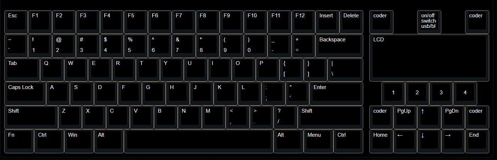

 # DIYkeyboard

## 驱动
* [ ] lcd
* [ ] 编码器
* [ ] 拨码管，使用IO拓展芯片扫描
* [ ] 按键扫描
* [ ] USB
* [ ] 蓝牙
* [ ] SD
* [ ] 指纹模块
* [ ] 电容触摸模块

## 功能

* [ ] bootloader
* [ ] HID协议
* [ ] HID媒体
* [ ] Fn自定义快捷键
    * 适配vim功能
    * 密码管理
* [ ] 侧边拓扑模块接口
* [ ] 轻量级运行时
* [ ] 内置计算器
* [ ] 电容触摸手势

